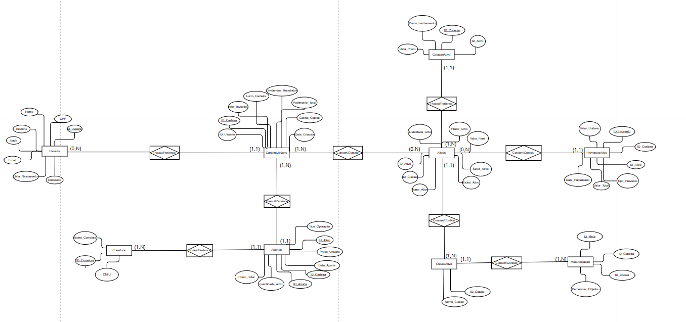
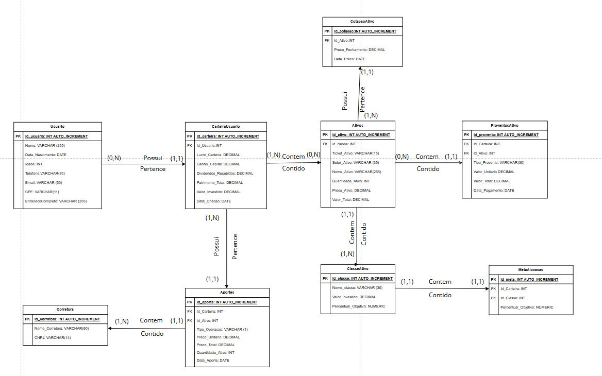
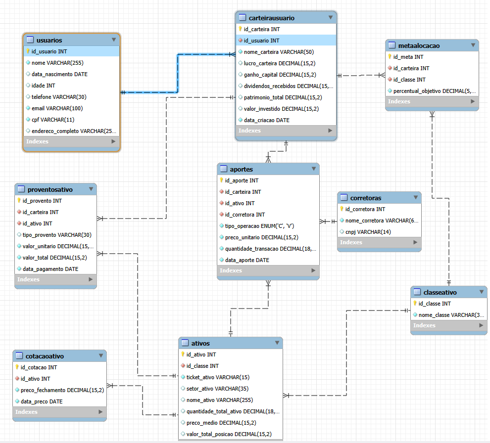

# Modelagem de Dados — Finance Easy

Projeto completo de modelagem relacional voltado ao domínio financeiro de investimentos. Cobre as três camadas do processo de modelagem — Conceitual, Lógico e Físico — e foi implementado em MySQL para gerenciar usuários, carteiras, ativos, cotações e proventos.

Desenvolvido como projeto prático de conclusão da trilha de Modelagem de Dados da Alura.

---

## Visão Geral

O Finance Easy é um sistema de gerenciamento de carteiras de investimento. Seu banco de dados foi projetado para suportar as operações centrais de uma plataforma de investimentos: cadastro de investidores, controle de carteiras, registro de aportes, acompanhamento de cotações e recebimento de proventos.

---

## Modelos

### Conceitual

Representa as entidades do negócio e seus relacionamentos, independente de tecnologia.



Entidades mapeadas:

- **Usuario** — investidor da plataforma
- **CarteiraUsuario** — carteira vinculada a um usuário
- **Ativos** — ações, FIIs e outros instrumentos financeiros
- **CotacaoAtivo** — histórico de preços de fechamento por ativo
- **ProventosAtivo** — dividendos e rendimentos recebidos por ativo na carteira
- **ClasseAtivo** — classificação dos ativos (renda fixa, renda variável, FIIs, etc.)
- **MetaAlocacao** — percentual objetivo de alocação por classe de ativo
- **Aportes** — registro de compras e vendas realizadas
- **Corretora** — corretora vinculada à operação de aporte

---

### Lógico

Define tipos de dados, chaves primárias, chaves estrangeiras e cardinalidades de cada relacionamento.



Destaques do modelo lógico:

- Relacionamento `(0,N) — (1,1)` entre `Usuario` e `CarteiraUsuario`: um usuário pode ter nenhuma ou várias carteiras; cada carteira pertence a exatamente um usuário
- Relacionamento `(1,N) — (0,N)` entre `CarteiraUsuario` e `Ativos` via tabela associativa `Aportes`: resolve o relacionamento muitos-para-muitos com atributos próprios (preço unitário, quantidade, data)
- `CotacaoAtivo` registra o histórico de preços com granularidade diária, permitindo análise temporal da performance
- `MetaAlocacao` conecta `CarteiraUsuario` e `ClasseAtivo`, armazenando o percentual objetivo de diversificação definido pelo investidor

---

### Físico — Reverse Engineer

Implementação real no MySQL Workbench com todas as constraints, tipos de dados e índices aplicados.



---

## Estrutura das Tabelas

| Tabela | Descrição |
|--------|-----------|
| `usuarios` | Cadastro do investidor com CPF, contato e dados pessoais |
| `carteirausuario` | Carteira com patrimônio total, lucro, ganho de capital e dividendos recebidos |
| `ativos` | Cadastro dos instrumentos financeiros com ticker, setor e classe |
| `cotacaoativo` | Histórico de preço de fechamento por ativo e data |
| `proventosativo` | Registro de proventos recebidos por ativo em cada carteira |
| `classeativo` — | Classificação dos ativos com percentual de valor investido |
| `metaalocacao` | Meta de alocação percentual por classe dentro de cada carteira |
| `aportes` | Operações de compra (`C`) e venda (`V`) com preço, quantidade e data |
| `corretoras` | Corretora vinculada à operação, identificada por CNPJ |

---

## Decisões de Modelagem

**Separação entre Ativos e CotacaoAtivo**
O preço do ativo não foi armazenado diretamente na tabela `ativos`. A tabela `cotacaoativo` permite armazenar o histórico completo de preços por data, possibilitando análises de performance e variação ao longo do tempo.

**Tabela de Aportes como associativa rica**
Em vez de uma relação simples entre carteira e ativo, a tabela `aportes` carrega atributos próprios da operação: tipo (compra ou venda via `ENUM`), preço unitário, quantidade e data. Isso permite rastrear cada transação individualmente.

**MetaAlocacao como entidade independente**
A meta de alocação por classe de ativo foi modelada em tabela própria, conectando carteira e classe. Isso permite que cada carteira tenha metas diferentes para as mesmas classes de ativos, sem replicação de dados.

**Campos calculados na camada de aplicação**
Indicadores como `lucro_carteira`, `ganho_capital` e `patrimonio_total` são armazenados na tabela `carteirausuario`, mas devem ser recalculados pela camada de aplicação a partir dos aportes e cotações — o modelo suporta tanto a leitura direta quanto o recálculo dinâmico.

---

## Tecnologias

- MySQL
- MySQL Workbench
- BRModelo (modelagem conceitual e lógica)

---

## Estrutura do Repositório

```
modelagem-finance-easy/
├── README.md
├── assets/
│   ├── modelo-conceitual.png
│   ├── modelo-logico.png
│   └── reverse-engineer.png
└── projeto/
    └── Modelagem de Dados - Projeto.zip
```

---

## Autor

**André Felipe dos Santos Ricardo**

Data & System Analyst — Joinville, SC

[](https://www.linkedin.com/in/itsandrezl/)
[](https://github.com/itsandrezl)
[](https://itsandrezl.github.io)
